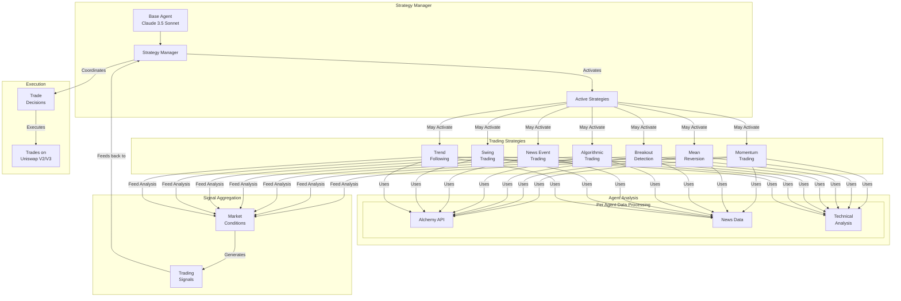

# Flock It

Flock It is a multi-agent trading system that uses LLM-powered agents to analyze market conditions and execute trades based on various trading strategies. The system employs a base agent that coordinates multiple specialized strategy agents, each implementing different trading approaches.

## Features

### Agent Architecture

🤖 Base Strategy Agent with configurable LLM model (default: Claude 3.5 Sonnet)

🔄 Multiple specialized trading strategies:
- Momentum Trading
- Mean Reversion
- Breakout Detection
- Algorithmic Trading
- News Event Trading
- Swing Trading
- Trend Following

📊 Dynamic strategy activation based on market conditions

💡 Intelligent parameter optimization and risk management

**Design Flowchart**


### Strategy Implementations

Base Agent: Coordinates strategy selection and manages overall trading decisions

Strategy-Specific Agents:

- Mean Reversion: Uses statistical deviations from moving averages
- Momentum: Analyzes short and long-term price movements
- Algorithmic: Combines multiple technical indicators
- Trend Following: Uses moving averages and momentum indicators
- Breakout: Identifies price breakouts with volume confirmation
- News Event: Analyzes market impact of news events
- Swing: Trades between support and resistance levels

### Trading & Execution:

⚡ Real-time market data analysis using Alchemy API

🔄 Ethereum Sepolia testnet support

💹 Automated trade execution via Uniswap V2/V3

📈 Risk management with configurable position sizes and stop-losses

### Prerequisites
[Same as base README](https://github.com/chain-ml/alphaswarm?tab=readme-ov-file)

### Getting Started
1. Installation

   [Same as base README](https://github.com/chain-ml/alphaswarm?tab=readme-ov-file)

2. API Keys Setup

   Before running the framework, you'll need to obtain several API keys:

   - LLM API KEY:

     - [Anthropic API Key](https://docs.anthropic.com/en/api/getting-started) if using Claude models (default)

   - Blockchain Access:

      - [Alchemy API Key](https://www.alchemy.com/api) (required for blockchain data)
      - RPC URLs from [Alchemy](https://docs.alchemy.com/reference/api-overview)
      - Ethereum Sepolia testnet RPC URL
      - Ethereum Wallet Address
   - Ethereum Private Key

   - News Access:

     - [Cookie Fun API Key](https://cookiefun.com/api)

3. Environment Configuration
Create your environment file:
```
cp .env.example .env
```
Sample .env file
```
# LLM Configuration
ANTHROPIC_API_KEY=your_anthropic_api_key

# Blockchain Access
ALCHEMY_API_KEY=your_alchemy_api_key

# New Access
COOKIE_FUN_API_KEY=your_cookie_fun_api_key

# Ethereum Configuration
ETH_RPC_URL=your_ethereum_mainnet_rpc
ETH_SEPOLIA_RPC_URL=your_sepolia_rpc
ETH_WALLET_ADDRESS=your_wallet_address
ETH_PRIVATE_KEY=your_private_key

# Logging Configuration
LOG_LEVEL=INFO  # DEBUG, INFO, WARNING, ERROR, CRITICAL
LOG_FORMAT=%(asctime)s - %(name)s:%(lineno)d - %(funcName)s - %(levelname)s - %(message)s
```

### Running the Bot
To start the trading agents:
```   
make run-agents
```
For additional information or if you encounter any issues, please refer to the base [README](https://github.com/chain-ml/alphaswarm?tab=readme-ov-file)