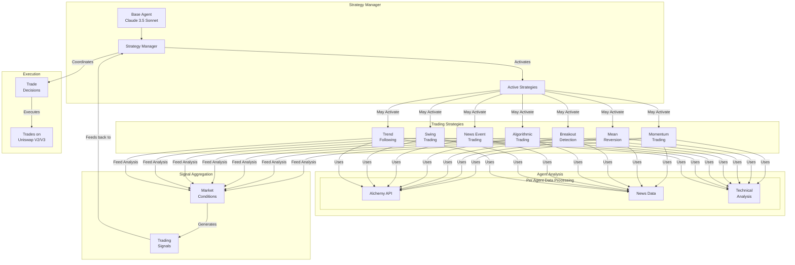

# Flock It

Flock It is a multi-agent trading system that uses LLM-powered agents to analyze market conditions and execute trades based on various trading strategies. The system employs a base agent that coordinates multiple specialized strategy agents, each implementing different trading approaches.

## Features

### Agent Architecture

🤖 Base Strategy Agent with configurable LLM model (default: Claude 3.5 Sonnet)

🔄 Multiple specialized trading strategies:
- Momentum Trading
- Mean Reversion
- Breakout Detection
- Algorithmic Trading
- News Event Trading
- Swing Trading
- Trend Following

📊 Dynamic strategy activation based on market conditions

💡 Intelligent parameter optimization and risk management

**Design Flowchart**
